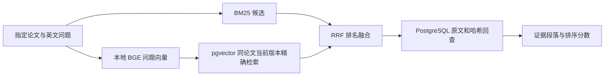

# P2B-1：本地向量与混合检索

日期：2026-09-22。P2B-1 工程验收通过。本增量覆盖检索对照；Reranker、生成、引用支持检查、拒答尚未完成，用户学习验收也尚未开展。

## 实测验收结果

- 1,169 篇论文的 61,317 段正文全部完成编码，形成 61,467 个窗口向量；pgvector 0.8.6，384 维。
- 本机 MPS 构建耗时 453.02 秒；重复运行返回 `reused`。这不是其他设备的性能承诺。
- 100 项后端测试通过（含真实 PostgreSQL/S3 与向量索引），14 项前端测试通过，TypeScript/Vite 生产构建成功。
- 浏览器实测未完成索引的明确错误提示，以及 BM25、向量、混合三种真实结果；分数分别标为 BM25、余弦和 RRF。截图确认控件与结果排版；同时修正了旧宽屏断点覆盖可拖动三列布局的问题。
- 在线三种模式均返回 5 条同篇证据，并通过数据库事实回查；PostgreSQL、S3 与向量集合已就绪。首次浏览器混合请求约 4.53 秒，包含初始化；随后纯向量样例约 32.6 毫秒。这仅是单次观察，没有并发或延迟 SLA 验收。

冻结的 745 道 dev 文本证据题结果如下，BM25 逐题排名与 P1 的差异为 0：

| 方式 | Hit@5 | 证据 Recall@5 | MRR@5 |
|---|---|---|---|
| BM25 | 58.52% | 50.64% | 0.3330 |
| BGE 向量 | 66.17% | 58.23% | 0.4170 |
| BM25 + BGE + RRF | 65.91% | 58.11% | 0.4148 |

相对 BM25，向量新增 142 道命中、丢失 85 道；混合新增 94 道、丢失 39 道。RRF 保留了更多原有命中，同时新增命中也更少。本轮向量比混合多命中 2 道，不能据此宣称有统计显著优势；固定 RRF 并未在本次实验中超过纯向量，不隐藏这个结果，也没有为改好 dev 指标追加调参。

这是已知论文内的证据检索评测，排除了不可回答、标注分歧及缺少完整文本证据的题目，不是答案准确率，也不能证明图表问答、中文提问或全库发现质量。向量和融合分数均不是答案正确概率。后续先用退步案例指导 Reranker 消融，再进入生成/核验。

报告：[索引构建](../reports/p2b_vector_build.json)、[逐题三组评测](../reports/p2b_retrieval_dev.json)、[在线样例检查](../reports/p2b_runtime_check.json)。离线 745 条问题的批量编码含加载耗时 4.325 秒；报告中的检索延迟不含问题编码，不和上述浏览器单请求延迟混用。

## 本次代码解决什么

BM25 擅长匹配具体术语、方法名、数字，但问题与正文采用不同表达时可能漏掉证据。BGE 将英文问题和段落编码到同一向量空间；RRF 把词法与向量排名合并。前端可以对同一问题切换三种模式，默认仍为 BM25，响应中的分数类型随实际检索方式变化。



用户也可选择单独 BM25 或向量路线，均经过同一事实回查。引用段落 ID 与 P1 保持一致。向量窗口仅服务于编码和评分，不会改变离线 gold 段落边界。

## 为什么这样选

| 选择 | 本项目的理由 | 代价和替代方案 |
|---|---|---|
| BGE-small-en-v1.5 | 当前语料与基准问题是英文；约 127 MiB 的固定权重适合本机 16GB；本地调用无 API 按量收费 | 英文模型不保证中文问题质量；较大或多语言模型需另做同题对照 |
| 直接 Transformers + PyTorch | 显式控制 tokenizer、CLS、归一化、窗口和批量推理，便于解释索引如何产生 | Sentence Transformers/FlagEmbedding 封装更方便；这里接受少量编码代码以明确输入和聚合边界 |
| pgvector 精确余弦检索 | 复用 PostgreSQL，并通过版本外键和同篇过滤绑定事实；指定论文内候选少 | HNSW/IVFFlat 应在全库或大规模检索需求下比较速度、召回、过滤行为与建索引成本 |
| RRF | 融合排名，不需要把 BM25 与余弦分数强行放在同一量纲 | 丢失原始分差，候选截断和常数都会影响结果；不是必然优于单路 |
| 多窗口的最高余弦值 | 避免把超过 512 token 的段落尾部直接丢弃 | 多窗口会增加计算量，最大值聚合可能偏向长段落；需通过错误分析检验 |

模型参数依据 [BGE 官方模型卡](https://huggingface.co/BAAI/bge-small-en-v1.5)；精确检索与 ANN 的区别依据 [pgvector 文档](https://github.com/pgvector/pgvector)。效果判断只使用本项目实测，不能用模型卡上的其他数据集分数替代。

## 数据与索引生命周期

`vector_collections` 保存配置、语料发布版本和 `building/ready` 状态。`paragraph_vectors` 保存窗口向量，并通过 `(version_id, chunk_id)` 外键引用正文段落。集合 ID 由语料版本和固定模型/预处理配置生成；模型 revision、分窗、前缀等变化会得到不同的集合 ID。

构建脚本只从 PostgreSQL 读取已发布正文。每批事务必须提交每段的全部窗口，失败则整批回滚；重新运行跳过此前完整提交的段落。构建结束核对覆盖数量，再锁住语料发布记录并检查版本，只有版本未变化才发布 `ready`。旧集合仍可保留作审计，新语料查询不会使用它。当前没有自动回收旧集合的后台任务。

在线请求检查当前集合已就绪；向量 SQL 先限定论文及当前版本，再计算距离；融合后的 ID 仍要回查原文和哈希。索引不存在或模型缺失时返回明确失败，不静默伪装成成功的混合检索。API 首次加载模型验证固定文件 SHA-256，加载仅使用本地 safetensors，不隐式下载模型或执行模型仓库代码。

这些检查证明证据来源和内容一致性，不证明某个未来生成的结论受到证据支持。下一增量需要分别验证重排质量和答案支持关系。

## 如何复现

从仓库根目录运行，先按 README 准备本机数据库与论文正文：

```bash
brew install pgvector
.venv/bin/python -m pip install -r requirements-retrieval-lock.txt
.venv/bin/python scripts/prepare_embedding_model.py
.venv/bin/python scripts/build_vector_index.py --device mps
.venv/bin/python scripts/evaluate_hybrid.py --device cpu
RUN_STORAGE_INTEGRATION=1 .venv/bin/python -m pytest -q
npm --prefix frontend test
npm --prefix frontend run build
```

Apple GPU 可使用 `mps`，其余机器先使用 `cpu`；锁定依赖在 macOS ARM / Python 3.12 实测，其他平台需另验兼容性。模型、向量和原文均留在 Git 忽略的本地存储，仓库仅保存代码、协议和不含正文/gold 文本的报告。API 默认 CPU 推理，可通过 `RESEARCH_EMBEDDING_DEVICE` 配置，首个向量请求含模型加载成本。

`build_vector_index.py` 完成同版本构建后再次运行会复用，不覆盖首次构建耗时报告。`evaluate_hybrid.py` 校验 P1 冻结的数据哈希和每题 BM25 排名，再通过实际服务执行三组对照；问题向量离线批量预计算，不将此耗时当作在线端到端延迟。没有访问官方 test。

当前服务仍是本机单进程。原有服务锁会串行处理检索，首个请求还可能构建内存 BM25/加载模型；没有并发压测或延迟 SLA。浏览器取消请求只停止前端等待，不保证终止已经运行的本地推理。

## 源码阅读顺序

1. `embeddings.py`：跟随一段英文经过 tokenizer、特殊 token、窗口、CLS 与归一化；明确“384 维”和“512 token”分别约束什么。
2. `004_vector_index.sql`、`vector_store.py`：看外键、精确检索 SQL、每批提交、断点恢复与最终发布的事务范围。
3. `retrieval.py` 中 `reciprocal_rank_fusion`：手算一组两路排名，并观察只有单路命中时的分数。
4. `service.py`：看三种路线如何统一回查事实，跟踪 `trace` 中的模型调用、语料版本和分数类型。
5. `evaluate_hybrid.py` 与评测报告：比较新增/丢失命中，区分工程检查通过与质量指标提高。

后续追问已追加到 `科研论文助手Agent面试问题.md`，不自动开启面试。
