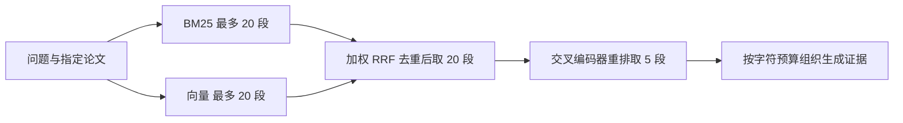

# P2B-4：RRF 调参与生成质量对照

日期：2026-09-22。实验按 `P2B-RRF与生成质量实验协议v3.md` 执行，版本继续为 0.3.2。**本轮实验与功能工程已验收；生成可信度未通过质量验收，暂不进入 P3。**

## 先回答：20 个候选是否过多

这里的 20 是送给本地重排模型的候选段落上限，不是一次送给 DeepSeek 的 20 段。当前单篇论文范围、最终证据 5 段时：



没有一个适合所有 RAG 的统一候选数。[Sentence Transformers 官方示例](https://www.sbert.net/examples/sentence_transformer/applications/retrieve_rerank/README.html) 对大语料先召回约 100 个候选，再重排；这是示例，不能据此说单篇论文也需要 100。对我们可以把 **10、15、20** 作为后续小范围试验值；本轮固定 20 是为了隔离 RRF 常数和权重的影响，尚未证明 20 最优，也没有证明缩到 10 不会漏证据。候选越多通常增加交叉编码器计算，但仅改变候选上限不一定增加最终生成上下文。

单篇不足 20 段时返回实际可用数量；零权重一路的独有候选不用于凑满数量。API 重排候选为 `max(20, top_k)`，本实验固定 `top_k=5`；页面选返回 Top 20 会改变最终证据量，不属于这轮对照。

## RRF 平滑常数与权重

本轮用户指定的 K 是 RRF 平滑常数。两路融合为：

```text
S(d) = 2 × (1 - α) / (K + BM25 名次(d))
     + 2 × α       / (K + 向量名次(d))
```

只对文档实际出现在的列表累加，排名从 1 开始。两路权重都乘 2，是为了在 α=0.5 时完整保留旧版分数及排名。K 越大，列表头尾的贡献差距越小；它不决定返回条数。RRF 是按名次融合，不是对 BM25 分数与余弦相似度直接做加权平均。

网格：K=10/30/60/100，向量权重=0/0.25/0.5/0.75/1，共 20 组。只在 train_tuning 选择参数；先看 Recall@5，再看 MRR@5，完全相同时保留等权/K60。证据评测排除不可答和映射不完整的题，因此三组分母为 55/53/53，不能写成每组 80 道检索题。

| 数据池 | 原等权 K60 Recall@5 | 纯向量+重排 Recall@5 | 原等权 MRR@5 |
|---|---:|---:|---:|
| train_tuning（55） | 54.06% | 53.97% | 0.3603 |
| train_regression（53） | 56.87% | 55.26% | 0.4091 |
| dev_comparison（53） | 62.58% | 60.69% | 0.4478 |

结果：**仍选 K60、向量权重 0.5，线上默认不变。** 调参组中各 K 在同一权重下重排后的指标相同；这不代表 RRF 的原始分数或候选顺序完全相同，也不代表任何数据上都不敏感。两路重叠、融合裁剪后留下的段落、交叉编码器重新排序，都可能削弱 K 对最终前五名的影响。0.25/0.75 的偏置可能很强：例如 K60、20 个名次中，同一路第 1 与第 20 的贡献比仅为 80/61，而 0.75:0.25 的路间权重比是 3。

此前完整 745 题 dev 中纯向量+重排更好；此次小型平衡子集等权略高，不能以小样本覆盖完整基线结论，也没有据此改用混合作为所有问题的最佳方案。按论文聚类的配对区间见 `p2b_quality_intervals_v3.json`。RRF 网格没有付费模型调用，离线缓存重排分数的耗时不代表每组在线延迟。

## 生成与核验实测

冻结三个池，各 80 题（抽取、概括、是非、不可答各 20），共 240 个问题、v1/v2 共 480 次回答流程。同题使用完全相同的 dense+rerank 前五段，输出英文以匹配英文参考答案。官方 test 未访问；dev 已在检索阶段看过，不称未见测试集。

v1 保留原结论列表；v2 增加简洁答案且必须等于首条已核验结论。v2 核验返回支持/矛盾/不足、问题相关性和支持摘录；程序检查每条支持引用属于该 claim，且摘录真实存在于段落中。这能防止伪摘录、跨 claim 借用引用，**不能硬性证明语义蕴含**。

| 数据池 | v1 Answer F1 | v2 Answer F1 | v1 → v2 发布比例 | 不可答标注题发布数 v1 → v2 |
|---|---:|---:|---:|---:|
| train_tuning | 12.14% | 27.36% | 70.00% → 63.75% | 12/20 → 11/20 |
| train_regression | 15.91% | 36.94% | 72.50% → 63.75% | 12/20 → 9/20 |
| dev_comparison | 17.59% | 40.42% | 73.75% → 63.75% | 9/20 → 9/20 |

v2−v1 Answer F1 的按论文配对 bootstrap 95% 区间分别为 +8.23～22.80、+13.33～29.12、+14.41～31.93 个点（固定种子 20260922、2,000 次；未做多重比较校正）。区间反映这批开发样本下的抽样变化，不涵盖标注偏差和模型随机性。

| v2 题型 Answer F1 | 调参组 | 回归组 | dev 对照组 |
|---|---:|---:|---:|
| 抽取 | 22.16% | 45.31% | 47.22% |
| 概括 | 17.06% | 16.51% | 24.16% |
| 是非 | 30.21% | 40.94% | 35.31% |
| 不可答 | 40.00% | 45.00% | 55.00% |

这些 F1 不是答案正确率。v1 以完整已发布结论合并计算，v2 以简答计算，**输出格式变化是这次干预的一部分**；尤其 v1 即使写了正确的完整是非句，也可能不满足 Yes/No 完全匹配。不能将 F1 增幅全部归因于核验增强。下一轮需固定生成草稿，只替换核验器，才能隔离核验效果。

v2 在可回答的 60 题中显式证据不足率为 20%、20%、23.33%，均高于 v1 的 11.67%、10%、13.33%，说明更保守也会损失覆盖。不可答题发布率是相对 QASPER 标注的指标，仍需逐例审阅，不等于已人工认定的幻觉率。

证据 F1 只对映射完整样本报告分母；Answer F1 保留所有 80 题。模型故障或核验失败记 0，不能偷换成正确拒答。回归组 v2 有 1 次结构化输出不合规，保留失败，没有重试或丢弃。真实语义支持率为 `null/pending`，未冒充人工盲审。

## 为什么简单挑战通过仍不可靠

构造了 20 对、40 个正反案例，涵盖数字、单位、否定、比较、条件、全部范围、未来工作、语言范围与引用归属。正反答案使用真实存在于构造段落中的引用，避免仅凭“引用不存在”就轻易答对。

v1/v2 各调用核验 40 次：各支持例 20/20 放行、各不支持例 20/20 拦截，无调用故障。它们是**工程构造的合成标签**，不是独立人工金标；结果没有证明 v2 更强，也没有证明真实 RAG 安全。

实际漏判样本：调参题 ID `1db37e98768f09633dfbc78616992c9575f6dba4`，论文 `1705.03151`。问题询问数据库规模，证据描述本研究从该数据库选了七种语言，v2 发布了语言列表和数据划分说明。这里既有子集/全集范围风险，也没有直接回答所需的规模信息。核验器仍判通过。这是本轮输出的分析性审阅，不是独立人类标注；全文和模型记录保留在本机 `.local/generation-quality-v3/`。

## 调用、费用与验收

生成对照 855 次调用，输入 1,185,070 token，输出 152,073 token，按峰时未缓存价估算 USD 0.5380086。加上合成核验合计 935 次调用、估算 USD 0.5581794；记录以 `p2b_verifier_challenges_v3.json` 的 budget 为准。按 [DeepSeek 官方定价](https://api-docs.deepseek.com/quick_start/pricing/) 的当日 deepseek-flash 输入 USD 0.30/M、输出 USD 1.20/M 估算，忽略缓存折扣；不是账单。

本机评测每次调用前写入预算预留，再按 usage 结算，未知用量保守保留预留额；无自动重试。总上限 1,000 次和估算 USD 1。该记账器仅用于本机单进程评测，不是多机费用治理。生成计时排除了两臂共享的检索准备，四个离线任务并发，不能当作在线 P95 SLA。线上仍同一时刻仅运行一条生成链，新旧策略共用并发门。

后端 193 项测试（含真实 PostgreSQL/S3 集成）、前端 20 项测试与生产构建；浏览器实测混合检索 K10/向量75% 返回五段并正确显示 Trace 参数，窄窗口实验选项可用。评测源码逐文件哈希见 `p2b_quality_source_manifest_v3.json`。没有把评测问题/答案导入在线索引；全文与密钥未提交。

页面“混合 RRF → 实验设置”可选 K/权重；生成任务可选 v1/v2 与中文/英文。v2 标为实验，默认仍为 v1；默认打开工作台仍是仅检索证据。

## 学习顺序与下一步

1. 先读 `retrieval.py` 的融合函数，手算一个只在一路出现的段落和一个同时出现的段落；再读 `service.py` 的候选裁剪与重排。分清四个数字：每路候选、融合候选、最终上下文、RRF 平滑常数。
2. 读 `generation.py`，区分引用完整性、语义支持、直接回答问题与发布前版本复查。真实存在的引用不能自动证明答案；拒答结构也不能替代业务正确性。
3. 读 `quality_metrics.py` 和冻结分层清单，理解题型、分母、状态与格式对 F1 的影响。先审阅不可答发布、概括低分和可答拒答，建立独立标注规范。
4. 下一轮应固定生成草稿隔离核验效果，并构造来自真实失败类型的更难挑战；新增样本先冻结，已曝光的题只做回归。不要继续按 dev 结果改提示后称为未见验证。
5. 然后单独测试候选量 10/15/20 的 Recall、重排后效果与延迟；若证据已召回却未进入前五，优先定位排序损失，不能只扩候选。存在生成/核验问题时，也不能期望仅调整 RRF K 就解决。

对应面试问题已补充到根目录文件，本轮不立即提问。工程验证完成不等于用户已经掌握，也不等于生成质量达标。
