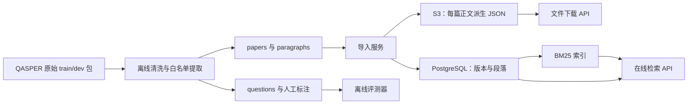
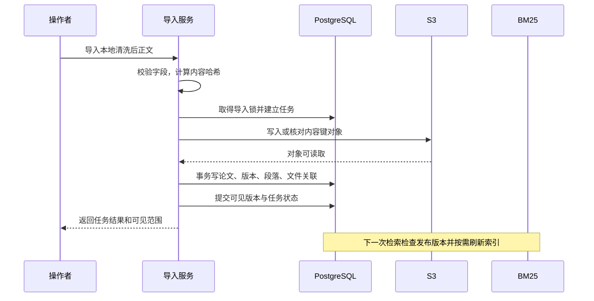
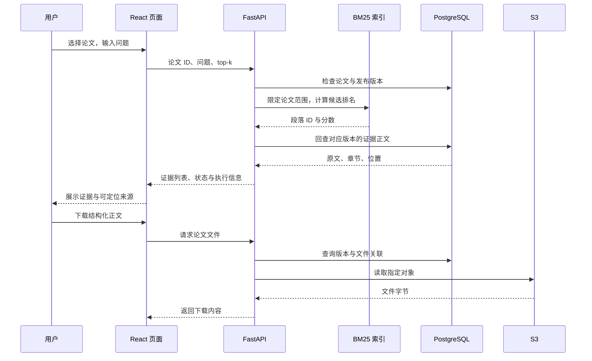

# 架构选型与数据流

> 阶段：P2A「有持久化存储的论文检索工作台」。本文记录设计目标和取舍；是否已实现、具体版本、启动命令与实测结果以阶段验收记录为准。
> 用户已确定先接通前后端、数据库和对象存储。原 P4 的基础工作台提前；向量检索、生成和引用支持关系核验留在 P2B，Harness、记忆与反馈按后续阶段推进。

## 1. 这一阶段解决什么

P1 已经验证「问题 → 指定论文内 BM25 检索 → 原文证据」。P2A 保留这个算法，把数据从本地 JSONL 接到真实 PostgreSQL，并提供可以直接操作的网页。由此观察完整链路：页面发请求、后端执行业务、数据库提供事实、对象存储提供文件。

阶段产物是论文检索工作台。它展示检索到的段落及其位置；BM25 分数用于当前查询中的排序，不表示回答可信概率。没有模型生成时不显示伪造的“AI 总结”，也不把“没有关键词命中”解释成论文不可回答。

这一阶段只使用公开的 QASPER 正文，面向本机开发。私人论文、身份鉴权、团队权限、PDF 解析质量、多实例部署和生产高可用需要另行实现与验收。

## 2. 组件各自负责什么

| 组件 | 本阶段职责 | 依赖关系与边界 |
|---|---|---|
| React + TypeScript | 论文列表、检索输入、证据展示、导入状态和错误提示 | 通过 HTTP 调后端；不直接连数据库，不接触存储密钥 |
| Vite | 本地前端开发和静态资源构建 | 开发代理方便联调；生产如何提供静态文件需另行部署配置 |
| FastAPI | 校验请求、查询论文、执行检索、读取文件、返回清楚的失败状态 | 是业务入口；后续授权和 Harness 在这一层及其内部服务中接入 |
| PostgreSQL 18 | 论文、版本、段落、文件元数据、导入任务与发布状态 | 约束与事务管理事实；不能代替对象存储做跨服务原子提交 |
| 进程内 BM25 索引 | 从数据库正文构建词法索引，返回候选段落 ID 和排序分数 | 可以重建；内容发布后需要刷新；本阶段以单 API 进程为验收范围 |
| SeaweedFS S3 | 保存每篇论文经过白名单筛选的结构化正文 JSON | 通过 S3 接口访问；本地单机后端，不等于分布式高可用已经验证 |
| 离线评测文件 | 保存问题、答案、人工证据标签与评测结果 | 由评测程序读取；不能进入在线数据库、在线存储桶或模型上下文 |

事实存储和检索索引是两种职责。BM25 返回候选后，后端按论文、版本和段落 ID 回查数据库中的正文，再形成引用。以后即使向量库也保存文本，回查仍有统一版本与权限判断的价值。

## 3. 为什么选择这套前后端

| 选择 | 对当前系统的收益 | 替代方案何时更合适、我们承担什么代价 |
|---|---|---|
| React + TypeScript | 论文选择、证据面板、异步状态和后续 Trace 可拆成组件；类型帮助约束前后端数据形状 | Vue 同样能做好本系统。选择 React 是项目的一致性决策，不是认定 Vue 性能或能力不足；两者都需要状态管理和接口约定 |
| Vite 单页应用 | 当前主要是登录后式工作台交互，先把展示与 Python API 的边界建立清楚 | Next.js 适合需要服务端渲染、搜索可见页面或相应服务端能力的产品；目前引入第二套服务端运行时的收益较小。后续有公开论文落地页时可重评 |
| 正式前端而非 Streamlit 主界面 | 证据定位、请求取消、错误状态、不同区域独立更新可以按产品需要设计 | Streamlit 适合快速实验和内部演示。我们接受 React 页面与 API 分开开发的工作量，用于学习真实交互与接口协作 |
| FastAPI | 现有检索和评测使用 Python；类型化请求与 OpenAPI 便于契约联调 | Flask 可以实现相同业务，但要自行搭配更多校验与文档约定；Django 的管理后台和完整业务设施在复杂运营后台中有价值；NestJS 适合 TypeScript 服务，但本系统的 Python 检索仍需集成 |

Vite 提供开发与构建能力，接口仍由 FastAPI 承担；前端编译成功不代表接口契约正确。[Vite 官方指南](https://vite.dev/guide/)

FastAPI 的异步机制适合等待网络和存储 I/O，不会让 BM25 建索引、PDF 解析等 CPU 工作自动变快。同步数据库客户端也不能仅靠把路由写成 `async def` 就变为非阻塞；具体调用要与客户端执行方式匹配。[FastAPI 并发说明](https://fastapi.tiangolo.com/async/)

本阶段采用模块化单体：路由负责 HTTP，服务负责检索与导入规则，存储适配器负责 SQL/S3。模块边界先清楚，后续有长任务、独立扩容或故障隔离需求时再拆 worker 或服务。

## 4. 为什么是 PostgreSQL、S3 与后置的 Redis

### 数据库：关系约束优先，保留灵活字段

论文拥有版本，版本拥有段落与文件引用，导入任务影响版本发布。这些关联适合用主键、外键、唯一约束和事务表达。PostgreSQL 事务能让一组数据库变更一起提交或回滚；发布时可以避免用户看到“版本可用，但段落还没写完”的数据库中间状态。[PostgreSQL 事务](https://www.postgresql.org/docs/18/tutorial-transactions.html)

稳定且常查的字段使用普通列，如论文 ID、版本 ID、段落顺序、任务状态。来源附加信息可使用 JSONB；JSONB 支持 JSON 查询与索引，但仍需对重要字段建立明确约束，不把全部实体打包成一个巨大对象。[PostgreSQL JSON 类型](https://www.postgresql.org/docs/18/datatype-json.html)

MongoDB 也能保存论文、支持事务，并非无法实现可信 RAG。本系统选择 PostgreSQL，是因为要练习跨实体约束、版本发布和后续统计查询，并接受 schema 迁移的维护成本。SQLite 很适合单机原型；当前明确需要接通独立数据库服务，故不把 SQLite 当作 PostgreSQL 实接的替代证明。

### 向量：P2B 先验证 pgvector，再决定是否拆出 Milvus

pgvector 是 PostgreSQL 扩展，可在已有事实库附近保存和查询向量，减少首轮混合检索的部署组件。它支持精确检索，也提供近似索引；选择哪种需要结合数据、过滤条件、召回率与延迟实验。[pgvector 官方仓库](https://github.com/pgvector/pgvector)

本阶段仅接 PostgreSQL，不因数据库已运行就声称向量检索已经完成。Milvus 留作需要独立向量服务、扩容或专项学习时的候选。两者不能按一个固定文档数分界判断优劣，也不能把 pgvector 的测试结果写成 Milvus 的结果。

### 对象存储：文件本体与业务关联分开

数据库保存“文件属于哪篇论文、哪个版本、存在哪里、哈希是什么”；对象存储保存文件字节。当前对象是经过清洗的正文 JSON，未来可扩展到有来源记录的 PDF 与解析产物。

| 方案 | 合理用途 | 本项目取舍 |
|---|---|---|
| 数据库 BLOB | 文件与业务记录需要同一数据库事务，且文件规模与访问方式适合统一备份 | 可以实现，但大文件会参与数据库备份、复制与读写负担；本项目预期包含 PDF 和解析产物，选择分开存放 |
| 本地文件目录 | 最小原型、临时文件、单进程工具 | 部署迁移、进程共享、访问入口要自己约定；不把本地路径适配器称为 S3 接入 |
| S3 兼容接口 | 通过桶与对象键访问文件，可替换具体存储后端 | 增加一个服务和跨服务一致性问题；接受这些成本来建立后续文件生命周期能力 |

本地使用 SeaweedFS，因为官方提供单个 `weed` 二进制与 S3 服务入口，适合本轮 macOS ARM 开发环境，不以 Docker 为前置条件。S3 兼容意味着使用我们实际测试过的 S3 操作；不能推导所有 AWS S3 行为都已完全验证。[SeaweedFS 官方仓库与启动说明](https://github.com/seaweedfs/seaweedfs)、[官方发行页](https://github.com/seaweedfs/seaweedfs/releases)

单机进程和本地数据目录需要独立备份；本阶段没有主机故障切换实验。选择 SeaweedFS 不意味着它的所有分布式能力都已接入，也不构成对其他对象存储产品的性能排名。

### Redis：等到具体职责出现

短期会话、重复查询缓存或任务分发可能需要 Redis。目前 PostgreSQL 已能保存导入任务状态，检索也可以直接运行，所以不先增加 Redis。后续即使引入队列，持久任务结果仍保存在数据库；至少一次投递时需要业务幂等，不能让“同一条任务收到了两次”生成两个已发布版本。

## 5. 数据模型与保存边界

以下是概念模型；实际表名与字段以数据库迁移和存储代码为准。

| 实体 | 关键内容 | 维护的关系与约束 |
|---|---|---|
| 论文 | 论文 ID、标题、摘要、来源、划分 | 标识论文；当前发布版本必须可定位 |
| 论文版本 | 版本标识、正文内容哈希、状态、发布时间 | 同一内容重复导入不产生重复版本；发布的版本有完整段落 |
| 段落 | 稳定段落 ID、版本、章节、段落顺序、正文 | 定位证据，区分同文不同位置；不含人工答案与证据标签 |
| 文件元数据 | 桶、对象键、SHA-256、类型、字节数、版本归属 | 元数据是文件关联，不能代替对象存在性与内容校验 |
| 导入任务 | 来源、幂等标识、状态、进度、失败原因 | 把失败与重试留作可观察记录；不把 HTTP 返回成功当成导入已完成 |

对象键以内容哈希形成稳定地址，概念示例为 `papers/<paper_id>/<sha256>.json`。具体格式以实现为准。相同字节得到相同键，修改内容得到新键；应用不覆盖历史内容。这个约定不等同于开启了 S3 Object Lock 或禁止管理员删除文件。

派生 JSON 只包含白名单字段：论文信息、章节、段落、来源与数据版本。不能直接把原始 QASPER 论文对象序列化后上传，因为其嵌套内容可能包含 `qas`、标准答案和证据标注。

原始下载包和 `questions.jsonl` 留在离线数据目录。在线桶只保存清洗后的正文文件，在线数据库不保存 gold。评测器可向服务发送问题并在服务外比较证据，服务本身不需要读取标准答案。

## 6. 导入与原子发布

实现顺序为：校验白名单数据与稳定 ID → 取得导入锁并创建任务 → 写入对象并读回校验 → 数据库事务写入事实并发布。检索服务在下一次请求检查发布版本，并按需刷新索引。

数据库事务只覆盖数据库写入。若对象已写成功、数据库提交失败，可能留下暂未被任何已发布版本引用的对象；这叫孤儿对象。任务保留失败原因，重试复用稳定内容键，后续通过对账识别孤儿。`orphaned` 记录也可能对应尚未写入成功的文件，因此记录数不能直接当成实际泄漏对象数。清理应核对引用并设置保留期，不能因为一次请求失败就直接删除同键对象。

导入使用单写入者约束与 PostgreSQL advisory lock，避免两个导入器同时修改发布状态。advisory lock 是应用协作约定，不会自动阻止绕过约定的 SQL；所有写入入口必须遵循同一锁规则，数据库唯一约束仍是最后防线。连接中断与进程退出后的锁释放行为取决于使用会话级还是事务级锁，具体实现与测试必须保持一致。[PostgreSQL advisory locks](https://www.postgresql.org/docs/18/explicit-locking.html#ADVISORY-LOCKS)

幂等表示同一份输入重复执行后，发布状态与正文数量保持一致。它不等于“发现任务记录就跳过”：上次可能失败，或对象后来丢失；重试需要判断任务、版本和对象的实际状态。

## 7. 一次页面检索经过哪些组件

正常检索使用数据库里的正文，不需要每次去 S3 下载整篇文件。两份内容的关系通过版本与内容哈希记录：数据库方便过滤、定位和回查；对象文件用于原始产物保留、导出与重建。

在线索引仍沿用 P1 的 BM25 参数和分词方式。数据库接入不会自动提高召回率；同语料、同问题、同配置的结果应与 P1 对照，发现差异先检查数据、排序和索引刷新。

页面需要区分请求处理中、空结果、输入错误和服务故障。切换论文时不能把上一篇论文的结果当成当前结果；较早发出的慢请求也不能覆盖较新的查询。前端状态正确同样是可信展示的一部分。

## 8. 失败时怎样解释与恢复

| 失败场景 | 设计行为 | 要验证的事实 |
|---|---|---|
| 重复导入相同数据 | 复用稳定对象和已存在版本，报告重复或已完成 | 段落数、版本数与可见内容不无故增长 |
| S3 写失败 | 导入失败，不发布引用不完整对象的新版本 | 数据库没有半成品被标记为可用 |
| S3 写成、数据库提交失败 | 旧版本保持可见，记录失败，允许按内容键重试 | 对象与数据库不被假称已经原子提交；孤儿可识别 |
| 数据库不可用 | 列表、版本核验、检索回查返回可解释的服务失败 | 不用进程内旧正文绕过版本回查并伪装成功 |
| S3 不可用、数据库可用 | 已导入正文仍可检索；文件下载和新导入明确失败 | 工作台能展示部分可用，不能把文件错误改成空论文 |
| 指定对象丢失 | 下载报告文件不可用并留下定位信息 | 不返回空文件作为成功；不从无关版本补一个文件 |
| 数据已发布、索引未刷新 | 显示或阻止使用未准备的索引；重试刷新 | 页面不能无限使用已失效的旧索引；实际恢复路径需验收 |
| 两个导入请求竞争 | 同一写入锁下串行执行或清楚返回忙碌状态 | 不同时发布两个互相冲突的当前版本 |
| 问题没有词法命中 | 返回空证据与具体状态 | 不把词法检索失败当作经过验证的拒答 |

本地工程验收应覆盖至少一次真实数据库和对象存储读写、重复导入、重启后读取、下载与正文一致、依赖故障及恢复，以及在线数据没有混入 gold。测试通过情况只写到执行后生成的验收记录中。

## 9. 接下来的源码阅读与学习检查点

1. 从页面的“检索”动作找到请求体、后端路由和响应类型，理解类型检查与运行时校验的区别。
2. 沿论文 ID 找到版本、段落与文件关联，能说明哪些信息放普通列、哪些放 JSONB、哪些成为文件。
3. 追踪一个内容哈希从清洗到对象键再到数据库记录的过程，理解哈希用途和不能保证的事项。
4. 对照事务边界定位发布时刻，复现“对象已写、数据库失败”的状态并观察重试。
5. 观察 BM25 候选 ID 如何回查成原文引用，确认排名分数、引用存在和答案受支持是不同概念。
6. 停止一个依赖后观察页面表现，明确检索、下载与导入分别依赖什么。
7. 将运行结果与 P1 比较，区分架构接通、算法提升和模型回答质量三种验收。

这些是后续讲解与操作练习的顺序，当前不进行面试提问。面试题仍集中维护在根目录 `科研论文助手Agent面试问题.md`；完成工程交付不等于用户已经完成学习验收。
